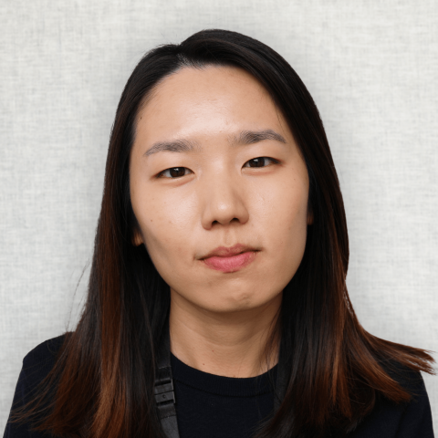

## Contents

- The context: what is `movement`?

- Current governance structures

- Requirements for future governance

## The Sainsbury Wellcome Centre

::: {layout="[[-10, 80, -10], [-15, 35, -5, 30, -15]]" layout-align="center"}

:::

::: aside
> Our research mission is to discover the fundamental principles of how the brain drives behaviour.
:::

::: footer
[sainsburywellcome.org](https://www.sainsburywellcome.org/web/)
:::

## The Neuroinformatics Unit {.smaller}

:::: {columns}

::: {.column width="45%"}

:::

::: {.column width="55%"}

What we do:

:::{.incremental}
- **Novel open-source software** for analysing brain activity and animal behaviour.
- **Collaborations** with researcher labs and other software teams.
- **Spreading knowledge**  via teaching, documentation.
:::

:::

::::

::: aside
> A **research software engineering** (RSE) team... dedicated to the development of high quality, accurate, robust, easy to use and maintainable open-source software for neuroscience and machine learning.
:::

::: footer
[neuroinformatics.dev](https://neuroinformatics.dev)
:::

## Tracking animals in videos

](img/sleap_video.gif){fig-align="left"}

## `movement` overview {.smaller}

{height=450}

::: aside
 ~60k downloads (PyPI + conda-forge)

 26 code contributors, 50% from outside UCL

 Public forum hosts 82 members across 53 threads
:::

::: footer
[movement.neuroinformatics.dev](https://movement.neuroinformatics.dev/)
:::

## How `movement` came to be {.smaller}

::: {.fragment fragment-index=1}
- 2022: SWC leadership and Adam Tyson (NIU head) approved identify need for robust animal behavior analysis software.
:::

::: {.fragment fragment-index=2}
- 2023: Niko scoped out the project and started development.
:::

::: {.fragment fragment-index=3}
- 2024: Sofía and Chang Huan joined the `movement` team.
:::

::: {layout="[[20, 20, 20, 20]]"}

::: {.fragment fragment-index=1}

:::

::: {.fragment fragment-index=2}

:::

::: {.fragment fragment-index=3}

:::

::: {.fragment fragment-index=3}

:::

:::

## Current governance structure {.smaller}

