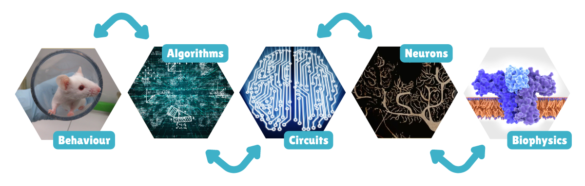
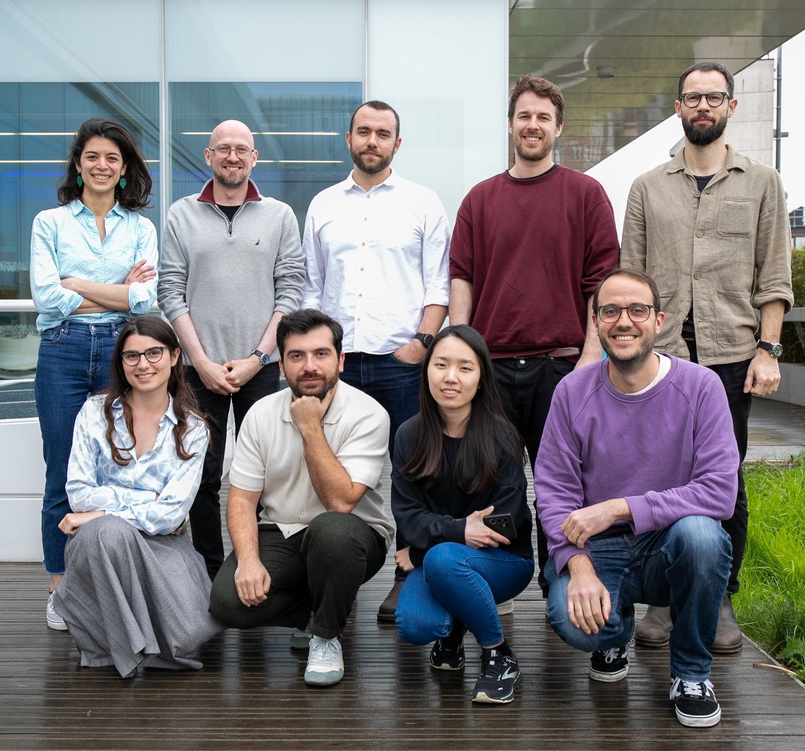
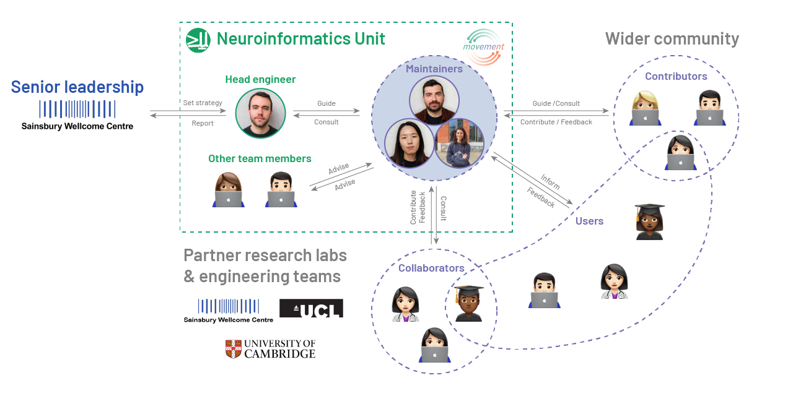

## Contents

- The context: what is `movement`?

- Examining current governance

- Challenges to address

::: aside
These slides are available at: [neuroinformatics.dev/slides-movement-governance](https://neuroinformatics.dev/slides-movement-governance/#/title-slide)
:::

## Sainsbury Wellcome Centre (SWC)

::: {layout="[[-10, 80, -10], [-15, 35, -5, 30, -15]]" layout-align="center"}




:::

::: aside
> Our research mission is to discover the fundamental principles of how the brain drives behaviour.
:::

::: footer
[sainsburywellcome.org](https://www.sainsburywellcome.org/web/)
:::


## Neuroinformatics Unit (NIU)

:::: {columns}

::: {.column width="50%"}

:::

::: {.column width="50%"}
> A **research software engineering** (RSE) team... dedicated to the development of high quality, accurate, robust, easy to use and maintainable open-source software for neuroscience and machine learning.
:::

::::

::: footer
[neuroinformatics.dev](https://neuroinformatics.dev)
:::


## Tracking animals in videos

](img/sleap_video.gif){height=450, fig-align="left"}


## `movement` overview {.smaller}

{fig-align="center"}

::: footer
[movement.neuroinformatics.dev](https://movement.neuroinformatics.dev/)
:::

## Who is involved in `movement`?

{fig-align="center"}


## `movement` size and growth {.smaller}

 ~60k downloads (PyPI + conda-forge)

 26 code contributors, 50% from outside UCL

 ~300 merged pull requests

 Public forum hosts 82 members across 53 threads

```{python}
# | echo: false

import pandas as pd
import matplotlib.pyplot as plt
import seaborn as sns
from matplotlib.dates import DateFormatter
from pathlib import Path

# Load matplotlib parameters (for proper fontrendering)
plt.style.use(Path.cwd() / "plots.mplstyle")

# set plotting style
#sns.set_style("ticks")
#sns.set_context("talk", font_scale=0.75)
```

```{python}
# | echo: false

csv_path = Path.cwd() / "data" / "movement-star-history-20251022.csv"

df = pd.read_csv(csv_path, parse_dates=["Date"])
df["Date"] = pd.to_datetime(df["Date"], errors="coerce")
df = df[df["Date"] >= "2023-01-01"].copy()

df["Month"] = df["Date"].dt.to_period("M").dt.to_timestamp()
monthly = (
  df.groupby("Month", as_index=False)
    .agg(stars=("Stars", "last"))
    .sort_values("Month")
)

# Plot cumulative stars
fig, ax = plt.subplots(figsize=(8, 4))
ax.plot(monthly["Month"], monthly["stars"], marker="o", color="#03A062")
ax.set_xlabel("Month")
ax.set_ylabel("GitHub stars")
ax.xaxis.set_major_formatter(DateFormatter("%Y-%b"))
plt.xticks(rotation=45, ha="right")

sns.despine()
plt.tight_layout()
plt.show()

```

::: footer
[movement.neuroinformatics.dev](https://movement.neuroinformatics.dev/)
:::

## Existing elements of governance {.smaller}

- **License:** BSD-3-Clause
- **Code of Conduct:** Contributor Covenant v3.0
- **Community** page, including:
  - **People**—leadership, collaborators, contributors
  - **How to contribute**
  - Statements of **mission**, **scope**, **design principles**
  - Public **communication channels**   

::: aside
For more details, see:

-  [movement.neuroinformatics.dev](https://movement.neuroinformatics.dev/)
-  [github.com/Neuroinformatics/movement](https://github.com/Neuroinformatics/movement)
:::

## Motivations for more formal governance

> Governance is the **formalisation** of **implicit norms and culture** in order to **scale collaboration**.

_Source: ["Governance for Software Engineers"](https://speaking.unlockopen.com/t7cQZt/open-source-governance-for-software-engineers#sne53yn), by Tobie Langel_

## Pitfalls to avoid

::: {.incremental}
- Avoid excessive bureaucracy: make process the backup plan, not the default.
- Don't define governance too early, let community dynamics emerge first.
- Avoid aspirational governance—spell out **existing norms**; do not invent new ones.
:::

## What are our existing norms? {.smaller} 

Looking through the lens of **Ostrom's three levels of governance**:

::: {.incremental}
1. **Operational:** the day-to-day, who has merge rights, who owns the server, who updates the social media? Whose weekends get ruined when something breaks?
2. **Collective:** what we normally think of as *governance*, who is in charge and how decisions are made.
3. **Constitutional:** the *meta* level, *who decides who decides*.
:::

::: aside
Sources:

- [Governing the Commons: The Evolution of Institutions for Collective Action](https://www.actu-environnement.com/media/pdf/ostrom_1990.pdf), by *Elinor Ostrom*.
- [In Introduction to Governance](https://governingopen.com/resources/why-governance.html), by *Shauna Gordon-McKeon*.
:::


## Operational level {.smaller}

| Task | Who has the rights? | Who does it? |
|------|---------------------|---------------|
| Approving PRs | Maintainers | Maintainers |
| Triaging issues | Maintainers | Maintainers |
| Releases | Maintainers | Mostly Niko |
| Community Calls | Maintainers | Mostly Niko |
| Social media | Adam | Adam |
| Conferences | Adam, Maintainers, Collaborators | Mostly Niko |
| Moderation and COC enforcement | Adam & Maintainers | Mostly Adam |

::: aside
[Governance Questionnaire](https://governingopen.com/resources/governance-questionnaire.html): to help you identify who plays what role in your community.
:::

## Collective level

For **major decisions**, such as roadmaps, feature prioritisation, and design changes:

::: {.incremental}
- **Collaborators** and **contributors** are often consulted.
- **Maintainers** decide by [Consensus](https://communityrule.info/templates/consensus.html).
- **Head engineer** (Adam) has the final say in case of deadlocks (rarely happens).
:::

## Constitutional level

::: {.incremental}
- **Niko** to draft a governance proposal for `movement`, incorporating Birdaro's training.
- **Maintainers** and **Adam** to provide feedback, iterating until consensus.
- **Collaborators** and **contributors** may also be consulted.
- Final approval may be required from **SWC senior leadership**.
- The governance document to be published and periodically reviewed.
:::

## Challenges to think about (1)

How do we prevent separation between the Neuroinformatics Unit and the wider community?

::: {.fragment}
- Enforce strict adherence to open communication channels.
- Create a pathway for external contributors to become maintainers.
:::

## Challenges to think about (2)

How do we scale the consensus-based decision-making process as the number of maintainers increases?

::: {.fragment}
- Gradually move towards a [Circles](https://communityrule.info/templates/circles.html) model.
- Formalise procedures for failures to reach consensus:
  - Introduce voting mechanisms for major decisions.
  - Acknowledge the Head Engineer's role as a tiebreaker.
:::

## Challenges to think about (3)

What if SWC completely changes course on `movement`?

::: {.fragment}
- Prepare a succession plan to make `movement` independent of SWC, if needed.
:::

## Recommended readings {.smaller}

- [Open Source Guide on Leadership and Governance](https://opensource.guide/leadership-and-governance/)
- [Governance of Open Source Software](https://governingopen.com/)
- [Governance for Software Engineers](https://speaking.unlockopen.com/t7cQZt/open-source-governance-for-software-engineers#sne53yn)
- [CommunityRule](https://communityrule.info/)
- [GitHub's Minimum Viable Governance](https://github.com/github/MVG)
